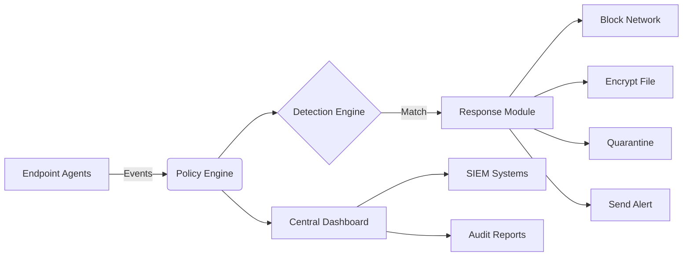
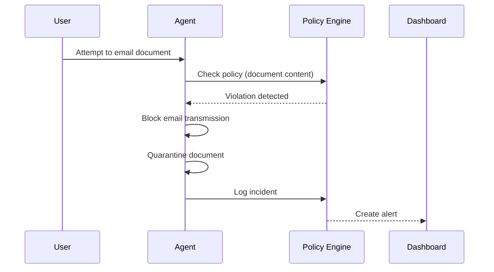
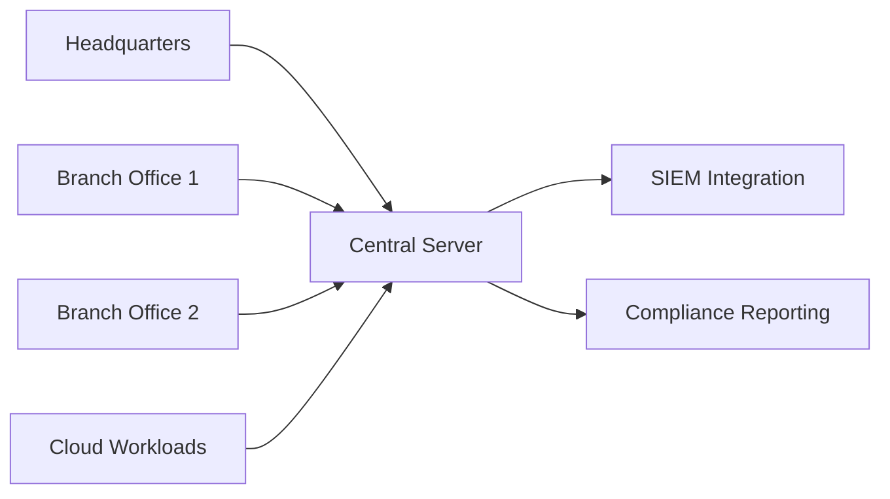

# FENTINEL: Universal Data Loss Prevention System 🔒🌐

```bash
███████╗███████╗███╗   ██╗████████╗██╗███╗   ██╗███████╗██╗     
██╔════╝██╔════╝████╗  ██║╚══██╔══╝██║████╗  ██║██╔════╝██║     
█████╗  █████╗  ██╔██╗ ██║   ██║   ██║██╔██╗ ██║█████╗  ██║     
██╔══╝  ██╔══╝  ██║╚██╗██║   ██║   ██║██║╚██╗██║██╔══╝  ██║     
██║     ███████╗██║ ╚████║   ██║   ██║██║ ╚████║███████╗███████╗
╚═╝     ╚══════╝╚═╝  ╚═══╝   ╚═╝   ╚═╝╚═╝  ╚═══╝╚══════╝╚══════╝
```

**One Policy. All Platforms. Complete Protection.** FENTINEL is an open-source, cross-platform Data Loss Prevention solution that safeguards sensitive data across Linux, Windows, and macOS environments with military-grade precision.

[](https://www.gnu.org/licenses/gpl-3.0)
[](https://github.com/sarat1kyan/Terminus)
[](https://github.com/sarat1kyan/Terminus)
[](https://github.com/sarat1kyan/Terminus)
[](https://github.com/sarat1kyan/Terminus)
[](https://www.python.org/downloads/)
[](https://www.python.org/downloads/)


## Table of Contents

- [Why FENTINEL?](#-why-fentinel)
- [Core Features](#-core-features)
- [Architecture Overview](#-architecture-overview)
- [Getting Started](#-getting-started)
  - [Prerequisites](#prerequisites)
  - [Installation](#installation)
- [Quick Start Guide](#-quick-start-guide)
- [Policy Management](#-policy-management)
- [Detection Capabilities](#%EF%B8%8F-detection-capabilities)
- [Response Actions](#-response-actions)
- [Dashboard & Monitoring](#-dashboard--monitoring)
- [Deployment Scenarios](#-deployment-scenarios)
- [Contributing](#-contributing)
- [License](#-license)
- [Acknowledgments](#-acknowledgments)

## 🚀 Why FENTINEL?

FENTINEL provides enterprise-grade data protection without enterprise complexity. Unlike traditional DLP solutions, FENTINEL offers:

- **Universal Policy Enforcement**: Define security policies once and enforce them consistently across all operating systems
- **Minimal Footprint**: Lightweight agents with average memory consumption under 10MB
- **Real-time Protection**: Monitor data in motion, at rest, and in use with near-zero latency
- **Open Architecture**: Extensible plugin system for custom detectors and integrations
- **Compliance Ready**: Pre-built templates for GDPR, HIPAA, PCI-DSS, and more



## 🧩 Core Features

| Feature | Linux | Windows | macOS | Description |
|---------|-------|---------|-------|-------------|
| **Network Monitoring** | ✅ | ✅ | ✅ | Inspect HTTP/HTTPS, SMTP, FTP, and custom protocols |
| **File System Guard** | ✅ | ✅ | ✅ | Real-time file operations monitoring with content inspection |
| **Clipboard Protection** | ✅ | ✅ | ✅ | Prevent sensitive data copying to unauthorized applications |
| **Print Control** | ✅ | ✅ | ✅ | Restrict printing of sensitive documents |
| **USB Device Control** | ✅ | ✅ | ✅ | Block or encrypt data transferred to removable media |
| **Cloud App Control** | ✅ | ✅ | ✅ | Monitor and control data uploaded to cloud services |
| **Content-Aware DLP** | ✅ | ✅ | ✅ | Regex, ML, and file fingerprinting detection |
| **Automated Remediation** | ✅ | ✅ | ✅ | Block, encrypt, quarantine, or alert on violations |
| **Central Management** | ✅ | ✅ | ✅ | Web-based dashboard for policy management and monitoring |

## 🏗️ Architecture Overview

FENTINEL follows a modular architecture designed for scalability and flexibility:

### Key Components
1. **Endpoint Agents**: Lightweight binaries collecting security-relevant events
2. **Policy Engine**: Centralized policy management and evaluation
3. **Detection Engine**: Multiple detection methods working in concert
4. **Response Engine**: Automated remediation actions
5. **Management API**: RESTful interface for administration and integration
6. **Web Dashboard**: Real-time monitoring and historical analysis

## 🚀 Getting Started

### Prerequisites

- Python 3.8+ (for source installation)
- Root/Admin privileges
- 100MB disk space
- Network connectivity to central management server

### Installation

#### Linux (Debian/Ubuntu)
```bash
# Add repository and install
curl -sSL https://dl.fentineldlp.io/install.sh | sudo bash -s -- linux
sudo apt install fentinel-agent

# Configure agent
sudo fentinel configure --server central.fentineldlp.io --token YOUR_ENROLLMENT_TOKEN
```

#### Windows
```powershell
# Run PowerShell as Administrator
Set-ExecutionPolicy Bypass -Scope Process -Force
iex ((New-Object System.Net.WebClient).DownloadString('https://dl.fentineldlp.io/install.ps1'))

# Configure agent
fentinel configure --server central.fentineldlp.io --token YOUR_ENROLLMENT_TOKEN
```

#### macOS
```bash
# Install via Homebrew
brew tap fentineldlp/tap
brew install fentinel-agent

# Configure agent
sudo fentinel configure --server central.fentineldlp.io --token YOUR_ENROLLMENT_TOKEN
```

## 🏎️ Quick Start Guide

1. **Create a Policy** (`policy.yaml`):
```yaml
version: 1.0
policies:
  - id: PCI_PROTECTION
    name: "Block Credit Card Data"
    description: "Prevent PCI data exfiltration"
    triggers:
      - type: network
        protocols: [http, https, smtp]
        pattern: "\b(?:\d[ -]*?){13,16}\b"
      - type: file
        extensions: [txt, doc, pdf, xlsx]
        pattern: "\b(?:\d[ -]*?){13,16}\b"
    actions:
      network: block
      file: quarantine
      alert: critical
```

2. **Apply Policy**:
```bash
fentinel policy apply policy.yaml
```

3. **Test Protection**:
```bash
# Attempt to create file with credit card
echo "Credit Card: 4111-1111-1111-1111" > test.txt

# Verify file was quarantined
fentinel quarantine list
```

4. **View Incidents**:
```bash
fentinel incidents list
```

## 📋 Policy Management

FENTINEL policies use YAML format with flexible matching rules:

```yaml
policies:
  - id: GDPR_PII_PROTECTION
    name: "GDPR Personal Data Protection"
    description: "Protect personally identifiable information"
    scope:
      users: ["*"]
      devices: ["laptops", "desktops"]
      locations: ["off-premises"]
    triggers:
      - type: any
        detectors:
          - name: regex
            pattern: "\b[0-9]{3}-[0-9]{2}-[0-9]{4}\b" # SSN
            confidence: high
          - name: ml-classifier
            model: gdpr-pii-v3
            threshold: 0.85
    actions:
      default: block
      exceptions:
        - application: "HR-System"
          action: allow
    compliance:
      frameworks: ["GDPR", "CCPA"]
```

### Policy Components:
1. **Scope**: Define where the policy applies
2. **Triggers**: Conditions that activate the policy
3. **Detectors**: Multiple detection methods
4. **Actions**: Response when policy is triggered
5. **Exceptions**: Allow specific scenarios
6. **Compliance**: Map to regulatory frameworks

## 🕵️‍♂️ Detection Capabilities

### Content Detection Methods

| Method | Best For | Performance | Accuracy |
|--------|----------|-------------|----------|
| **Regex Patterns** | Structured data (CC#, SSN) | ⚡⚡⚡⚡⚡ | Medium |
| **Machine Learning** | Unstructured text, documents | ⚡⚡⚡ | High |
| **File Fingerprinting** | Exact document matching | ⚡⚡⚡⚡ | Very High |
| **Metadata Analysis** | Contextual classification | ⚡⚡⚡⚡⚡ | Medium |
| **Custom Plugins** | Proprietary formats | Varies | Varies |

### Contextual Awareness
FENTINEL enhances detection accuracy with contextual factors:
- User role and permissions
- Geographic location
- Network context (corporate vs. public)
- Device security posture
- Time of access

## 🛡️ Response Actions

When a policy violation is detected, FENTINEL can execute multiple response actions:

1. **Block**: Prevent the action in real-time
2. **Encrypt**: Automatically encrypt sensitive data
3. **Quarantine**: Move files to secure storage
4. **Alert**: Notify security teams via multiple channels
5. **Log**: Detailed forensic record for investigation
6. **Custom**: Execute user-defined scripts



## 📊 Dashboard & Monitoring

FENTINEL provides a comprehensive dashboard for security operations:

```bash
███████╗███████╗███╗   ██╗████████╗██╗███╗   ██╗███████╗██╗     
██╔════╝██╔════╝████╗  ██║╚══██╔══╝██║████╗  ██║██╔════╝██║     
█████╗  █████╗  ██╔██╗ ██║   ██║   ██║██╔██╗ ██║█████╗  ██║     
██╔══╝  ██╔══╝  ██║╚██╗██║   ██║   ██║██║╚██╗██║██╔══╝  ██║     
██║     ███████╗██║ ╚████║   ██║   ██║██║ ╚████║███████╗███████╗
╚═╝     ╚══════╝╚═╝  ╚═══╝   ╚═╝   ╚═╝╚═╝  ╚═══╝╚══════╝╚══════╝

[+] 12,847 files monitored
[+] 3,210 network connections analyzed
[!] 2 policy violations blocked

RECENT INCIDENTS:
2023-07-05 14:23:18 | BLOCKED | PCI_BLOCK | user@macbook | Credit card in email attachment
2023-07-05 13:47:12 | QUARANTINED | CONFIDENTIAL_DOCS | user@win-pc | Source code in cloud sync

TOP RISK USERS:
1. jsmith@company.com (Risk Score: 87)
2. rjohnson@company.com (Risk Score: 72)
3. mdavis@company.com (Risk Score: 65)

DATA DISTRIBUTION:
PCI: 142 files
PII: 387 files
IP: 1,243 files
```

### Dashboard Features:
- Real-time incident monitoring
- Risk scoring and user behavior analytics
- Compliance reporting (GDPR, HIPAA, PCI-DSS)
- Customizable dashboards
- SIEM integration (Splunk, ELK, QRadar)
- Audit trail for all actions

## 🌐 Deployment Scenarios

### Enterprise Deployment


### Technical Requirements
| Component | Minimum | Recommended |
|-----------|---------|-------------|
| **Agent CPU** | 1 core | 2 cores |
| **Agent RAM** | 50 MB | 100 MB |
| **Server CPU** | 4 cores | 16 cores |
| **Server RAM** | 8 GB | 64 GB |
| **Storage** | 100 GB | 1 TB+ SSD |
| **Network** | 1 Gbps | 10 Gbps |

## 🤝 Contributing

We welcome contributions from the security community! Here's how to get involved:

1. **Report Issues**: 
   [Create a new issue](https://github.com/sarat1kyan/FENTINEL/issues) for bugs or feature requests

2. **Submit Pull Requests**:
   ```bash
   # Fork repository
   git clone https://github.com/your-username/FENTINEL.git
   cd FENTINEL
   
   # Create feature branch
   git checkout -b feature/new-detector
   
   # Install dev dependencies
   pip install -r requirements-dev.txt
   
   # Make changes and test
   pytest tests/
   
   # Commit and push
   git commit -m "feat: Add new detector for custom data type"
   git push origin feature/new-detector
   
   # Create pull request
   ```

3. **Development Guidelines**:
   - Follow PEP 8 style guide
   - Write unit tests for new features
   - Document public interfaces
   - Maintain backward compatibility
   - Use semantic versioning

## 📜 License

FENTINEL is released under the **GNU General Public License v3.0**.

```text
This program is free software: you can redistribute it and/or modify
it under the terms of the GNU General Public License as published by
the Free Software Foundation, either version 3 of the License, or
(at your option) any later version.

This program is distributed in the hope that it will be useful,
but WITHOUT ANY WARRANTY; without even the implied warranty of
MERCHANTABILITY or FITNESS FOR A PARTICULAR PURPOSE. See the
GNU General Public License for more details.

You should have received a copy of the GNU General Public License
along with this program. If not, see <https://www.gnu.org/licenses/>.
```

For commercial licensing options, please contact [licensing@fentineldlp.io](mailto:licensing@fentineldlp.io).

## 🙏 Acknowledgments

FENTINEL stands on the shoulders of giants in the open-source community:

- **eBPF Project** for Linux kernel instrumentation
- **Microsoft ETW Team** for Windows event tracing
- **Apple Endpoint Security** for macOS protection
- **TensorFlow** for machine learning capabilities
- **Elasticsearch** for search and analytics

Special thanks to our contributors and early adopters who helped shape FENTINEL into a robust DLP solution.

---

**Ready to secure your data?** Get started with FENTINEL in under 5 minutes and gain enterprise-grade protection across your entire organization.

[📚 Documentation](https://docs.fentineldlp.io) | 
[📦 Download](https://github.com/sarat1kyan/FENTINEL/releases) | 
[🐛 Report Issue](https://github.com/sarat1kyan/FENTINEL/issues) |
[💬 Discuss](https://github.com/sarat1kyan/FENTINEL/discussions)
