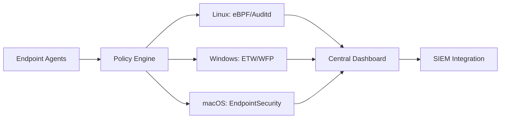
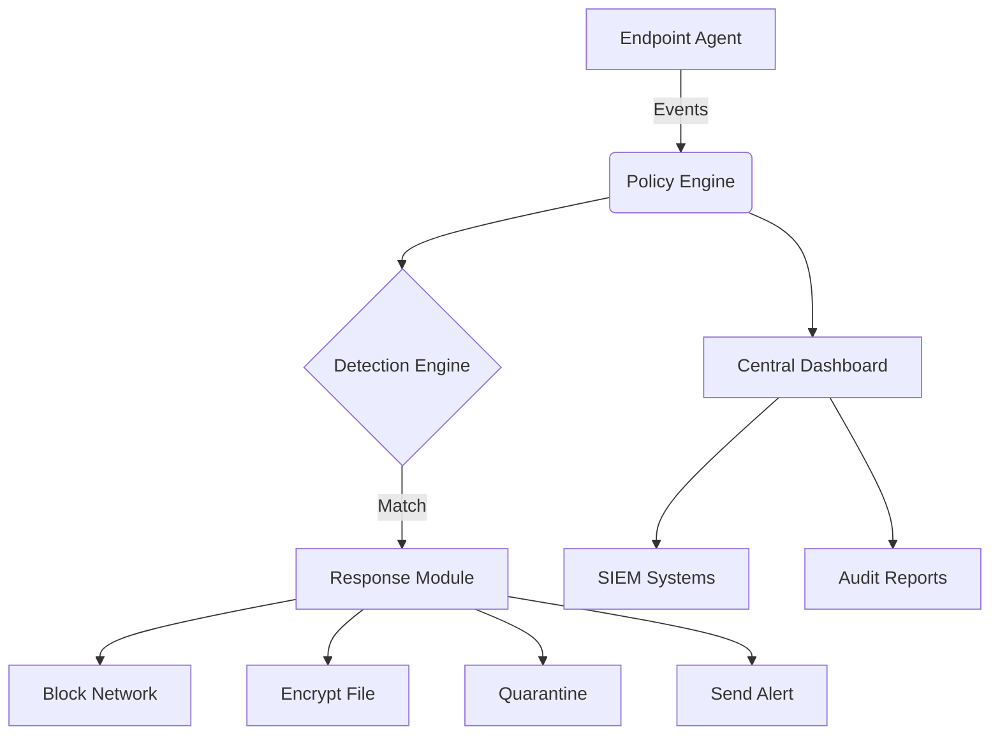

# FENTINEL: Universal Data Loss Prevention System 🔒🌐
```bash
███████╗███████╗███╗   ██╗████████╗██╗███╗   ██╗███████╗██╗     
██╔════╝██╔════╝████╗  ██║╚══██╔══╝██║████╗  ██║██╔════╝██║     
█████╗  █████╗  ██╔██╗ ██║   ██║   ██║██╔██╗ ██║█████╗  ██║     
██╔══╝  ██╔══╝  ██║╚██╗██║   ██║   ██║██║╚██╗██║██╔══╝  ██║     
██║     ███████╗██║ ╚████║   ██║   ██║██║ ╚████║███████╗███████╗
╚═╝     ╚══════╝╚═╝  ╚═══╝   ╚═╝   ╚═╝╚═╝  ╚═══╝╚══════╝╚══════╝
```

[](https://www.gnu.org/licenses/gpl-3.0)
[](https://github.com/sarat1kyan/Terminus)
[](https://github.com/sarat1kyan/Terminus)
[](https://github.com/sarat1kyan/Terminus)
[](https://github.com/sarat1kyan/Terminus)
[](https://www.python.org/downloads/)
[](https://www.python.org/downloads/)


**One Policy. All Platforms. Complete Protection.** FENTINEL is an open-source, cross-platform Data Loss Prevention solution that safeguards sensitive data across Linux, Windows, and macOS environments with military-grade precision.

## 🚀 Why FENTINEL?

| Feature | Benefit |
|---------|---------|
| 🔄 **Universal Policy Enforcement** | Define once, deploy everywhere - consistent protection across all OS environments |
| 🔍 **Real-time Data Monitoring** | Monitor data in motion, at rest, and in use with minimal performance impact |
| 🛡️ **Native OS Integration** | Leverages Windows ETW, macOS EndpointSecurity, and Linux eBPF for maximum efficiency |
| 📊 **Centralized Management** | Unified dashboard for policy management and incident response |
| ⚙️ **Automated Response** | Block, encrypt, quarantine, or alert on policy violations |



## 🧩 Core Components

1. **Lightweight Agents** - Cross-platform binaries (5MB RAM avg)
2. **Policy Engine** - YAML/JSON-based rules with regex and ML detection
3. **Response Module** - Automated encryption, blocking, and quarantine
4. **Dashboard** - Real-time monitoring and alerting (Web UI)

## ⚡ Quick Start

### Prerequisites
- Python 3.8+
- Root/Admin privileges
- 100MB disk space

### Installation
```bash
# Linux (Debian/Ubuntu)
curl -sSL https://install.sentinelshield.io/linux | sudo bash

# Windows (PowerShell)
iwr -useb https://install.sentinelshield.io/win | iex

# macOS (Homebrew)
brew tap FENTINEL/tap
brew install FENTINEL
```

### Sample Policy
Create `policy.yaml`:
```yaml
policies:
  - id: PCI_PROTECTION
    name: "Block Credit Card Data"
    description: "Prevent PCI data exfiltration"
    triggers:
      - type: network
        protocol: [http, https, smtp]
        pattern: "\b(?:\d[ -]*?){13,16}\b"
      - type: file
        extensions: [txt, doc, pdf, xlsx]
        pattern: "\b(?:\d[ -]*?){13,16}\b"
    actions:
      network: block
      file: quarantine
      alert: critical
```

### Start Protection
```bash
sentinelctl start --policy policy.yaml
```

## 🛠️ Key Capabilities

### Data Monitoring Matrix
| Data Type | Linux | Windows | macOS |
|-----------|-------|---------|-------|
| **Network Traffic** | ✅ nftables | ✅ WFP | ✅ Network Extensions |
| **File Operations** | ✅ inotify | ✅ Minifilter | ✅ FSEvents |
| **Process Activity** | ✅ eBPF | ✅ ETW | ✅ EndpointSecurity |
| **Print/Clipboard** | ✅ CUPS | ✅ PrintMonitor | ✅ Pasteboard |

### Detection Methods
- **Regex Patterns** (SSN, PCI, API keys)
- **Machine Learning** (unstructured data)
- **File Fingerprinting**
- **Contextual Analysis** (user roles, location)
- **Custom Plugins**

## 📊 Dashboard Preview

```bash
███████╗███████╗███╗   ██╗████████╗██╗███╗   ██╗███████╗██╗     
██╔════╝██╔════╝████╗  ██║╚══██╔══╝██║████╗  ██║██╔════╝██║     
█████╗  █████╗  ██╔██╗ ██║   ██║   ██║██╔██╗ ██║█████╗  ██║     
██╔══╝  ██╔══╝  ██║╚██╗██║   ██║   ██║██║╚██╗██║██╔══╝  ██║     
██║     ███████╗██║ ╚████║   ██║   ██║██║ ╚████║███████╗███████╗
╚═╝     ╚══════╝╚═╝  ╚═══╝   ╚═╝   ╚═╝╚═╝  ╚═══╝╚══════╝╚══════╝

[+] 12,847 files monitored
[+] 3,210 network connections analyzed
[!] 2 policy violations blocked

RECENT INCIDENTS:
2023-07-05 14:23:18 | BLOCKED | PCI_BLOCK | user@macbook | Credit card in email attachment
2023-07-05 13:47:12 | QUARANTINED | CONFIDENTIAL_DOCS | user@win-pc | Source code in cloud sync
```

## 🌐 Architecture Overview


## 🧪 Testing Scenarios
1. **Linux Test**:  
   `echo "Credit Card: 4111-1111-1111-1111" > test.txt`  
   *Expected: File quarantined and alert triggered*

2. **Windows Test**:  
   Try emailing `SSN: 123-45-6789` via Outlook  
   *Expected: Email blocked*

3. **macOS Test**:  
   Copy sensitive data to external USB  
   *Expected: Operation blocked with admin alert*

## 🤝 Contributing
We welcome contributions! Please see our [Contribution Guidelines](CONTRIBUTING.md) and:
```bash
# Setup dev environment
git clone https://github.com/your-repo/FENTINEL.git
cd FENTINEL
pip install -r requirements-dev.txt

# Build agents
make build-all
```

## 📜 License
FENTINEL is released under the [MIT License](LICENSE). Enterprise support and advanced features available.

---
**Protect what matters.** Deploy FENTINEL in under 5 minutes and gain enterprise-grade DLP protection across your entire organization.  

[📚 Documentation](https://docs.sentinelshield.io) | [📦 Download](https://github.com/your-repo/releases) | [🐛 Report Issue](https://github.com/your-repo/issues)
