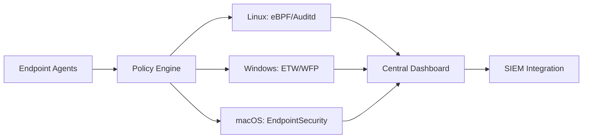
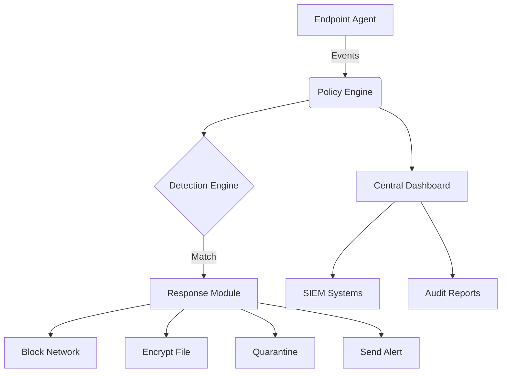

# FENTINEL: Universal Data Loss Prevention System 🔒🌐
```bash
███████╗███████╗███╗   ██╗████████╗██╗███╗   ██╗███████╗██╗     
██╔════╝██╔════╝████╗  ██║╚══██╔══╝██║████╗  ██║██╔════╝██║     
█████╗  █████╗  ██╔██╗ ██║   ██║   ██║██╔██╗ ██║█████╗  ██║     
██╔══╝  ██╔══╝  ██║╚██╗██║   ██║   ██║██║╚██╗██║██╔══╝  ██║     
██║     ███████╗██║ ╚████║   ██║   ██║██║ ╚████║███████╗███████╗
╚═╝     ╚══════╝╚═╝  ╚═══╝   ╚═╝   ╚═╝╚═╝  ╚═══╝╚══════╝╚══════╝
```

[](https://www.gnu.org/licenses/gpl-3.0)
[](https://github.com/sarat1kyan/Terminus)
[](https://github.com/sarat1kyan/Terminus)
[](https://github.com/sarat1kyan/Terminus)
[](https://github.com/sarat1kyan/Terminus)
[](https://www.python.org/downloads/)
[](https://www.python.org/downloads/)


**One Policy. All Platforms. Complete Protection.** FENTINEL is an open-source, cross-platform Data Loss Prevention solution that safeguards sensitive data across Linux, Windows, and macOS environments with military-grade precision.

## 🚀 Why FENTINEL?

| Feature | Benefit |
|---------|---------|
| 🔄 **Universal Policy Enforcement** | Define once, deploy everywhere - consistent protection across all OS environments |
| 🔍 **Real-time Data Monitoring** | Monitor data in motion, at rest, and in use with minimal performance impact |
| 🛡️ **Native OS Integration** | Leverages Windows ETW, macOS EndpointSecurity, and Linux eBPF for maximum efficiency |
| 📊 **Centralized Management** | Unified dashboard for policy management and incident response |
| ⚙️ **Automated Response** | Block, encrypt, quarantine, or alert on policy violations |



## 🧩 Core Components

1. **Lightweight Agents** - Cross-platform binaries (5MB RAM avg)
2. **Policy Engine** - YAML/JSON-based rules with regex and ML detection
3. **Response Module** - Automated encryption, blocking, and quarantine
4. **Dashboard** - Real-time monitoring and alerting (Web UI)

## ⚡ Quick Start

### Prerequisites
- Python 3.8+
- Root/Admin privileges
- 100MB disk space

### Installation
```bash
# Linux (Debian/Ubuntu)
curl -sSL https://install.sentinelshield.io/linux | sudo bash

# Windows (PowerShell)
iwr -useb https://install.sentinelshield.io/win | iex

# macOS (Homebrew)
brew tap FENTINEL/tap
brew install FENTINEL
```
# Cross-Platform DLP Deployment Guide

## Prerequisites

### All Platforms
- Python 3.8+ or compiled binary
- Administrative/root privileges
- Network connectivity to central management server
- SSL/TLS certificates for secure communication

## Linux Deployment

### 1. Package Creation

#### DEB Package (Debian/Ubuntu)
```bash
# Directory structure
dlp-agent/
├── DEBIAN/
│   ├── control
│   ├── postinst
│   ├── prerm
│   └── conffiles
├── etc/
│   ├── dlp/
│   │   └── agent.conf
│   └── systemd/system/
│       └── dlp-agent.service
├── usr/
│   ├── bin/
│   │   └── dlp-agent
│   └── lib/
│       └── dlp/
│           ├── ebpf_programs/
│           └── modules/
└── var/
    └── dlp/
        ├── logs/
        └── quarantine/

# control file
Package: dlp-agent
Version: 1.0.0
Architecture: amd64
Maintainer: Security Team <security@company.com>
Depends: python3 (>= 3.8), libssl1.1, libpcap0.8
Description: Cross-platform DLP Agent
 Data Loss Prevention agent for Linux systems

# Build package
dpkg-deb --build dlp-agent dlp-agent_1.0.0_amd64.deb
```

#### RPM Package (RHEL/CentOS/Fedora)
```bash
# dlp-agent.spec
Name:           dlp-agent
Version:        1.0.0
Release:        1%{?dist}
Summary:        Cross-platform DLP Agent
License:        Proprietary
URL:            https://company.com

Requires:       python3 >= 3.8
Requires:       openssl-libs
Requires:       libpcap

%description
Data Loss Prevention agent for Linux systems

%install
mkdir -p %{buildroot}/usr/bin
mkdir -p %{buildroot}/etc/dlp
mkdir -p %{buildroot}/usr/lib/systemd/system
cp dlp-agent %{buildroot}/usr/bin/
cp config/* %{buildroot}/etc/dlp/
cp systemd/* %{buildroot}/usr/lib/systemd/system/

%files
/usr/bin/dlp-agent
/etc/dlp/*
/usr/lib/systemd/system/dlp-agent.service

%post
systemctl daemon-reload
systemctl enable dlp-agent
systemctl start dlp-agent

# Build package
rpmbuild -bb dlp-agent.spec
```

### 2. Installation Steps

```bash
# Debian/Ubuntu
sudo dpkg -i dlp-agent_1.0.0_amd64.deb
sudo apt-get install -f  # Fix dependencies if needed

# RHEL/CentOS
sudo rpm -ivh dlp-agent-1.0.0-1.el8.x86_64.rpm

# Configure agent
sudo nano /etc/dlp/agent.conf
# Set CENTRAL_SERVER, certificates, etc.

# Enable eBPF (if using)
sudo modprobe bpf
sudo sysctl -w kernel.unprivileged_bpf_disabled=0

# Start service
sudo systemctl start dlp-agent
sudo systemctl status dlp-agent
```

### 3. Kernel Requirements
- eBPF support (kernel 4.4+, recommended 5.0+)
- Netfilter modules loaded
- SELinux/AppArmor policies configured

## Windows Deployment

### 1. MSI Package Creation

```powershell
# Directory structure
DLPAgent/
├── Program Files/
│   └── DLPAgent/
│       ├── DLPAgent.exe
│       ├── DLPService.exe
│       ├── Config/
│       └── Drivers/
│           └── DLPFilter.sys
├── ProgramData/
│   └── DLP/
│       ├── Logs/
│       └── Quarantine/
└── Windows/
    └── System32/
        └── drivers/
            └── DLPFilter.sys

# WiX installer script (Product.wxs)
<?xml version="1.0" encoding="UTF-8"?>
<Wix xmlns="http://schemas.microsoft.com/wix/2006/wi">
  <Product Id="*" Name="DLP Agent" Language="1033" 
           Version="1.0.0.0" Manufacturer="YourCompany">
    
    <Package InstallerVersion="200" Compressed="yes" InstallScope="perMachine" />
    
    <Feature Id="ProductFeature" Title="DLP Agent" Level="1">
      <ComponentGroupRef Id="ProductComponents" />
      <ComponentRef Id="ServiceComponent" />
      <ComponentRef Id="DriverComponent" />
    </Feature>
    
    <!-- Service Installation -->
    <Component Id="ServiceComponent" Guid="YOUR-GUID-HERE">
      <File Source="DLPService.exe" />
      <ServiceInstall Id="DLPService"
                      Name="DLPAgent"
                      DisplayName="DLP Agent Service"
                      Type="ownProcess"
                      Start="auto"
                      ErrorControl="normal" />
      <ServiceControl Id="StartService"
                      Start="install"
                      Stop="both"
                      Remove="uninstall"
                      Name="DLPAgent" />
    </Component>
    
    <!-- WFP Driver Installation -->
    <Component Id="DriverComponent" Guid="YOUR-GUID-HERE">
      <File Source="DLPFilter.sys" />
      <DriverInstall Legacy="yes"
                     ForceInstall="yes"
                     Sequence="1" />
    </Component>
  </Product>
</Wix>

# Build MSI
candle Product.wxs
light Product.wixobj -o DLPAgent.msi
```

### 2. Installation Steps

```powershell
# Run as Administrator

# Install MSI
msiexec /i DLPAgent.msi /quiet /norestart

# Or using PowerShell
Start-Process msiexec.exe -ArgumentList '/i', 'DLPAgent.msi', '/quiet' -Wait

# Configure agent
notepad C:\ProgramData\DLP\Config\agent.conf

# Install and start WFP driver
sc create DLPFilter type= kernel binPath= C:\Windows\System32\drivers\DLPFilter.sys
sc start DLPFilter

# Verify service
Get-Service DLPAgent
Get-NetFirewallFilter | Where-Object {$_.DisplayName -like "*DLP*"}
```

### 3. Requirements
- Windows 10/11 or Server 2016+
- .NET Framework 4.7.2+
- Windows Filtering Platform (WFP)
- ETW permissions

## macOS Deployment

### 1. PKG Package Creation

```bash
# Directory structure
DLPAgent/
├── Applications/
│   └── DLPAgent.app/
│       └── Contents/
│           ├── MacOS/
│           │   └── DLPAgent
│           ├── Info.plist
│           └── Resources/
├── Library/
│   ├── LaunchDaemons/
│   │   └── com.company.dlpagent.plist
│   └── Application Support/
│       └── DLP/
│           ├── Config/
│           └── Quarantine/
└── System/
    └── Library/
        └── Extensions/
            └── DLPNetworkExtension.kext/

# Create package
pkgbuild --root ./DLPAgent \
         --identifier com.company.dlpagent \
         --version 1.0.0 \
         --scripts ./scripts \
         DLPAgent.pkg

# Create product archive with requirements
productbuild --distribution distribution.xml \
             --resources ./resources \
             --package-path . \
             DLPAgent-Installer.pkg

# Sign package
productsign --sign "Developer ID Installer: YourCompany" \
            DLPAgent-Installer.pkg \
            DLPAgent-Installer-Signed.pkg
```

### 2. Installation Steps

```bash
# Install package
sudo installer -pkg DLPAgent-Installer-Signed.pkg -target /

# Grant necessary permissions
# System Preferences → Security & Privacy → Privacy
# Enable for DLPAgent:
# - Full Disk Access
# - Network Filtering
# - Endpoint Security

# Load launch daemon
sudo launchctl load /Library/LaunchDaemons/com.company.dlpagent.plist

# Verify
sudo launchctl list | grep dlpagent
ps aux | grep DLPAgent
```

### 3. Requirements
- macOS 10.15+ (Catalina or later)
- System Extension entitlements
- Notarization by Apple
- MDM deployment recommended

## Post-Installation Configuration

### 1. Central Server Registration
```bash
# All platforms - Register agent
dlp-agent register \
  --server https://dlp-central.company.com \
  --token <enrollment-token> \
  --cert /path/to/client.crt
```

### 2. Policy Synchronization
```bash
# Force initial policy download
dlp-agent sync-policies

# Verify policies
dlp-agent list-policies
```

### 3. Testing Installation
```bash
# Run self-test
dlp-agent test --comprehensive

# Test specific components
dlp-agent test --network-intercept
dlp-agent test --file-monitor
dlp-agent test --policy-engine
```

## Automated Deployment

### Using Configuration Management

#### Ansible Playbook
```yaml
---
- name: Deploy DLP Agent
  hosts: all
  become: yes
  
  tasks:
    - name: Install DLP Agent Package
      package:
        name: "{{ dlp_package_url }}"
        state: present
      
    - name: Configure DLP Agent
      template:
        src: agent.conf.j2
        dest: /etc/dlp/agent.conf
        mode: '0600'
    
    - name: Start DLP Service
      service:
        name: dlp-agent
        state: started
        enabled: yes
```

#### PowerShell DSC (Windows)
```powershell
Configuration DLPAgentConfig {
    Import-DscResource -ModuleName PSDesiredStateConfiguration
    
    Node $AllNodes.NodeName {
        Package DLPAgent {
            Name = "DLP Agent"
            Path = "\\fileserver\share\DLPAgent.msi"
            ProductId = "YOUR-PRODUCT-GUID"
            Ensure = "Present"
        }
        
        Service DLPService {
            Name = "DLPAgent"
            StartupType = "Automatic"
            State = "Running"
            DependsOn = "[Package]DLPAgent"
        }
    }
}
```

## Monitoring and Maintenance

### Health Checks
```bash
# Check agent status
systemctl status dlp-agent           # Linux
Get-Service DLPAgent                 # Windows
sudo launchctl list | grep dlp      # macOS

# View logs
tail -f /var/log/dlp/agent.log      # Linux
Get-Content C:\ProgramData\DLP\Logs\agent.log -Tail 50 -Wait  # Windows
log stream --predicate 'subsystem == "com.company.dlpagent"'   # macOS
```

### Updates
```bash
# Check for updates
dlp-agent check-update

# Apply updates (requires restart)
dlp-agent update --auto-restart
```
### Sample Policy
Create `policy.yaml`:
```yaml
policies:
  - id: PCI_PROTECTION
    name: "Block Credit Card Data"
    description: "Prevent PCI data exfiltration"
    triggers:
      - type: network
        protocol: [http, https, smtp]
        pattern: "\b(?:\d[ -]*?){13,16}\b"
      - type: file
        extensions: [txt, doc, pdf, xlsx]
        pattern: "\b(?:\d[ -]*?){13,16}\b"
    actions:
      network: block
      file: quarantine
      alert: critical
```

### Start Protection
```bash
sentinelctl start --policy policy.yaml
```

## 🛠️ Key Capabilities

### Data Monitoring Matrix
| Data Type | Linux | Windows | macOS |
|-----------|-------|---------|-------|
| **Network Traffic** | ✅ nftables | ✅ WFP | ✅ Network Extensions |
| **File Operations** | ✅ inotify | ✅ Minifilter | ✅ FSEvents |
| **Process Activity** | ✅ eBPF | ✅ ETW | ✅ EndpointSecurity |
| **Print/Clipboard** | ✅ CUPS | ✅ PrintMonitor | ✅ Pasteboard |

### Detection Methods
- **Regex Patterns** (SSN, PCI, API keys)
- **Machine Learning** (unstructured data)
- **File Fingerprinting**
- **Contextual Analysis** (user roles, location)
- **Custom Plugins**

## 📊 Dashboard Preview

```bash
███████╗███████╗███╗   ██╗████████╗██╗███╗   ██╗███████╗██╗     
██╔════╝██╔════╝████╗  ██║╚══██╔══╝██║████╗  ██║██╔════╝██║     
█████╗  █████╗  ██╔██╗ ██║   ██║   ██║██╔██╗ ██║█████╗  ██║     
██╔══╝  ██╔══╝  ██║╚██╗██║   ██║   ██║██║╚██╗██║██╔══╝  ██║     
██║     ███████╗██║ ╚████║   ██║   ██║██║ ╚████║███████╗███████╗
╚═╝     ╚══════╝╚═╝  ╚═══╝   ╚═╝   ╚═╝╚═╝  ╚═══╝╚══════╝╚══════╝

[+] 12,847 files monitored
[+] 3,210 network connections analyzed
[!] 2 policy violations blocked

RECENT INCIDENTS:
2023-07-05 14:23:18 | BLOCKED | PCI_BLOCK | user@macbook | Credit card in email attachment
2023-07-05 13:47:12 | QUARANTINED | CONFIDENTIAL_DOCS | user@win-pc | Source code in cloud sync
```

## 🌐 Architecture Overview


## 🧪 Testing Scenarios
1. **Linux Test**:  
   `echo "Credit Card: 4111-1111-1111-1111" > test.txt`  
   *Expected: File quarantined and alert triggered*

2. **Windows Test**:  
   Try emailing `SSN: 123-45-6789` via Outlook  
   *Expected: Email blocked*

3. **macOS Test**:  
   Copy sensitive data to external USB  
   *Expected: Operation blocked with admin alert*

## 🤝 Contributing
We welcome contributions! Please see our [Contribution Guidelines](CONTRIBUTING.md) and:
```bash
# Setup dev environment
git clone https://github.com/sarat1kyan/FENTINEL.git
cd FENTINEL
pip install -r requirements-dev.txt

# Build agents
make build-all
```

## 📜 License
FENTINEL is released under the [MIT License](LICENSE). Enterprise support and advanced features available.

---
**Protect what matters.** Deploy FENTINEL in under 5 minutes and gain enterprise-grade DLP protection across your entire organization.  

[📚 Documentation](https://docs.sentinelshield.io) | [📦 Download](https://github.com/sarat1kyan/releases) | [🐛 Report Issue](https://github.com/sarat1kyan/issues)
